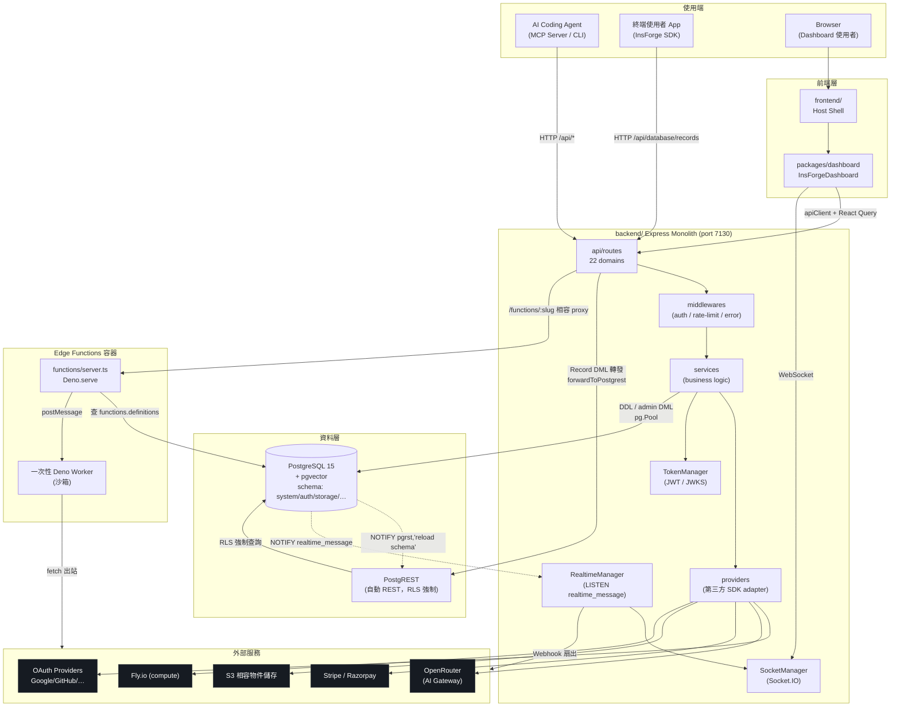
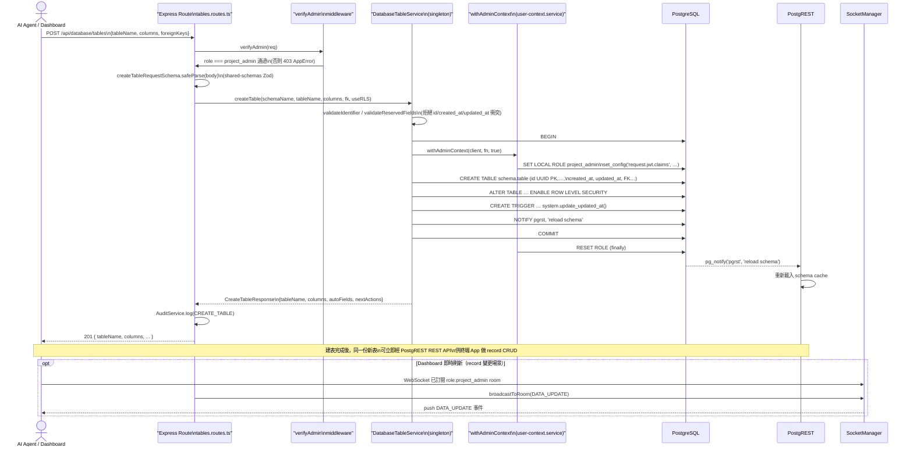

# InsForge 系統架構文件

> Trace 產出，來源 commit：`main`@`0dd55c5`（見 `.trace/TRACE_META.md`）。
> 本文件聚焦「系統元件與資料流」，程式碼目錄結構請參考 [`CODEBASE_MAP.md`](./CODEBASE_MAP.md)。

## 1. 一句話總結

InsForge 是一個開源 backend-as-a-service 平台，設計給 AI coding agent（透過 MCP Server / CLI）直接操作，
提供資料庫、認證、儲存、compute、edge functions、realtime、AI gateway、payments 等後端原語（primitive）。
系統以 **Express monolith backend** 為核心語意層，搭配 **PostgreSQL + PostgREST** 提供原生 REST，
外加獨立容器化的 **Deno Edge Functions runtime**，並以 **Socket.IO + pg_notify** 建立 pub-sub 即時通道。

## 2. 高層架構圖



> 圖中 **backend Express app** 與 **PostgREST** 是兩條並存、各自獨立打向同一個 PostgreSQL 的資料路徑，
> 不是上下游關係；兩者透過 `NOTIFY pgrst, 'reload schema'` 做 schema cache 同步。詳見第 5 節決策 D1。

## 3. 元件清單

| 元件 | 職責 | 關鍵檔案/目錄 | 上游依賴 | 下游依賴 |
|---|---|---|---|---|
| **Express backend app** | 核心 API server：DDL 管理、auth、業務邏輯 orchestration、對外「智慧語意層」 | `backend/src/server.ts`、`backend/src/api/`、`backend/src/services/` | Agent / SDK / Dashboard（HTTP） | PostgreSQL（`pg.Pool`）、PostgREST（proxy）、Deno runtime（HTTP）、各 provider |
| **PostgREST** | 由 Postgres schema 自動生成的 REST API，給終端 app 的 record CRUD 用，強制走 RLS | `docker-compose.yml`（`postgrest/postgrest:v12.2.12`） | Express backend（`forwardToPostgrest`，`backend/src/api/routes/database/records.routes.ts:141`） | PostgreSQL |
| **PostgreSQL** | 唯一持久化資料庫，含使用者資料表、`system`/`auth`/`storage`/`functions` 等內部 schema、pgvector | `backend/src/infra/database/migrations/`、`ghcr.io/insforge/postgres:v15.13.4` | Express backend、PostgREST、Deno functions server | — |
| **Deno Functions Runtime** | 使用者自訂 edge function 的執行容器，slug dispatch + 一次性 Worker 沙箱 | `functions/server.ts`、`functions/worker-template.js` | Express backend（`/functions/:slug` 相容 proxy，`server.ts:231-289`）、終端使用者直呼 | PostgreSQL（讀 `functions.definitions`/`system.secrets`）、外部 API（worker 內 `net:true`） |
| **Socket.IO (SocketManager)** | WebSocket 連線管理、房間廣播、presence | `backend/src/infra/socket/socket.manager.ts` | RealtimeManager、record CRUD route（`DATA_UPDATE` 事件） | 客戶端 WebSocket 連線 |
| **RealtimeManager** | `LISTEN realtime_message` 的唯一 subscriber，扇出到 WebSocket / Webhook | `backend/src/infra/realtime/realtime.manager.ts` | PostgreSQL（`pg_notify`） | SocketManager、`WebhookSender` |
| **packages/dashboard** | 可發佈的 dashboard 功能實作（14 個 feature 模組），self-hosting/cloud-hosting 共用 | `packages/dashboard/src/app/InsforgeDashboard.tsx`、`src/features/*` | `frontend/`（host shell） | Express backend（`apiClient`）、Socket.IO |
| **frontend shell** | self-hosting 用的最小 host，掛載 `@insforge/dashboard` | `frontend/src/App.tsx`、`src/self-hosting/` | Browser | packages/dashboard |
| **packages/ui** | React 設計系統元件庫、Tailwind preset | `packages/ui/src/index.ts`、`tailwind-preset.js` | packages/dashboard、frontend | — |
| **packages/shared-schemas** | Zod schema + TS 型別，前後端唯一契約來源 | `packages/shared-schemas/src/*.schema.ts` | — | backend routes（validation）、dashboard services（型別） |
| **OAuth Providers** | 8+1 家 OAuth/OIDC 供應商，統一 `OAuthProvider` interface | `backend/src/providers/oauth/base.provider.ts` 及 `*.provider.ts` | `AuthService` | 各家 OAuth API |
| **Payments Providers** | Stripe / Razorpay，各自獨立 class，無共用 interface | `backend/src/providers/payments/{stripe,razorpay}.provider.ts` | `services/payments/{stripe,razorpay}/` | Stripe/Razorpay API + webhook |
| **AI Gateway** | OpenAI 相容 chat/embedding/image API，代理至 OpenRouter | `backend/src/services/ai/chat-completion.service.ts`、`backend/src/providers/ai/openrouter.provider.ts` | `api/routes/ai` | OpenRouter → 多家 LLM |

## 4. 分層設計 / Module Boundary

### 4.1 Backend：route → service → provider → infra 四層

```
api/routes/<domain>/index.routes.ts   Express Router；掛 middleware（verifyAdmin/verifyUser…）、Zod 驗證、呼叫 service
services/<domain>/<domain>.service.ts 業務邏輯；singleton getInstance()；組 SQL / orchestrate provider
providers/<domain>/<vendor>.provider.ts 外部 SDK/HTTP 封裝（可選層，只有對接第三方時才有）
infra/{database,realtime,security,socket}/ 跨 domain 共用基礎設施（DB pool、pg_notify、JWT、WebSocket）
```

新增一個 domain（例如 `webscraper`）依此四層複製目錄結構即可，**唯一必須碰的中央檔案是 `backend/src/server.ts`**
（手動 `import` router + `apiRouter.use('/<domain>', xxxRouter)`，`server.ts:8-25`、`:205-224`）——這是
「約定優於配置」而非自動掃描的擴充機制（見 `.trace/_context/extensions.md` 第 1、8 節）。

### 4.2 Dashboard：`features/*` + `#imports` 邊界

`packages/dashboard/package.json` 定義 Node subpath imports（`#app/*`、`#features/*`、`#lib/*`、`#router/*` 等），
強制 feature 之間走絕對路徑而非深層相對路徑；每個 feature 內部固定切分
`components/ hooks/ services/ pages/`（可選 `lib/`、`contexts/`）。新增 feature 需手動在
`packages/dashboard/src/navigation/menuItems.ts` 登記側欄項目——同樣是中央清單模式，非自動探索。

### 4.3 Provider 抽象化程度不一致（重要邊界差異）

| Provider 群組 | 是否有共用 interface | 型態 |
|---|---|---|
| OAuth (`providers/oauth/`) | 是，`OAuthProvider`（`base.provider.ts:7-29`） | 完整 Strategy pattern |
| Storage / Email / Logs / Database provisioning / Compute | 是，各自 `base.provider.ts` | Strategy pattern（self-hosted vs cloud 切換） |
| Payments (`providers/payments/`) | **否**，`StripeProvider`/`RazorpayProvider` 各自獨立 class | 並列掛載，靠 `PaymentProvider` union type 分流 |
| AI (`providers/ai/`) | 不適用，僅 `OpenRouterProvider` 單一實作 | 委託 OpenRouter 聚合多模型，非 backend 內多 adapter |

## 5. 通訊模式

| 模式 | 使用場景 | 實作 |
|---|---|---|
| **Sync HTTP（REST）** | Agent/SDK ↔ backend；Dashboard ↔ backend；backend ↔ PostgREST proxy | Express route handler；`axios`（`postgrestAxios`，含 keep-alive + 3 次重試，`postgrest-proxy.service.ts:188-213`） |
| **Async Webhook** | Stripe/Razorpay/Vercel 事件回呼；InsForge realtime channel 對外扇出 | `app.use('/api/webhooks', express.raw(...), webhooksRouter)`（`server.ts:161`，需原始 bytes 驗簽）；`WebhookSender`（`backend/src/infra/realtime/webhook-sender.ts`） |
| **Pub-Sub（pg_notify + Socket.IO）** | Schema reload 通知 PostgREST；DB row 變更即時推播給訂閱者 | `NOTIFY pgrst,'reload schema'`（DDL 後）；`LISTEN realtime_message` → `RealtimeManager` → `SocketManager.broadcastToRoom()`（`realtime.manager.ts:45-190`） |
| **WebSocket** | Dashboard/客戶端即時訂閱、presence | Socket.IO，三種 handshake 認證（API key / anon key / JWT）對應 Postgres 三種角色（`socket.manager.ts:68-167`） |
| **Deno Worker postMessage** | Edge function 沙箱執行 | `new Worker(url, {type:'module', deno:{permissions:{...}}})` → `worker.postMessage({code, requestData, secrets})`（`functions/server.ts:164-246`）；worker 用 `self.onmessage`/`self.postMessage` 單次往返，執行完即 terminate |
| **相容性 HTTP Proxy** | 舊版 SDK 呼叫 `/functions/:slug` | `app.all('/functions/:slug', ...)`（`server.ts:231-289`）轉發至 Deno Subhosting 部署 URL 或本地 `denoRuntimeUrl` |

## 6. 關鍵設計決策與 Trade-off

### D1. Express backend 與 PostgREST 兩條並存資料路徑

**決策**：DDL（建表/改表/刪表，`database-table.service.ts:140-789`）與 dashboard 管理操作
（`admin.routes.ts`）由 Express 直連 `pg.Pool` 執行；一般 SDK 的 record CRUD
（`records.routes.ts:141-142` 的 `forwardToPostgrest`）則完全轉發給 PostgREST，Express 不碰 SQL。

**Trade-off**：好處是 Express 端可以做語意豐富的驗證/审计/next-actions 提示，PostgREST 端則用 Postgres 原生
RLS 保證「終端 app 存取資料一定受列級權限約束」，兩者責任清楚分離；代價是必須手動維護
`NOTIFY pgrst,'reload schema'` 這道同步機制（`database-table.service.ts:266-271,708-712,760-764`），
一旦漏發某個 DDL 路徑的 NOTIFY，PostgREST 的 schema cache 會過期不可見。Dashboard 又刻意繞過 PostgREST
走 admin 直連（`admin.routes.ts`），原因程式碼未註解，⚠️ 未驗證，合理推測是為了繞過 RLS 取得管理視角
＋支援 search/sort/CSV 匯出等 PostgREST 不易表達的查詢。

### D2. `getInstance()` singleton 而非 DI container

**決策**：全專案（152 個檔案含 `getInstance()`）一律用 `private constructor` + `static getInstance()`，
未引入 InversifyJS/tsyringe 等 IoC container。

**Trade-off**：優點是 route handler 可在任何檔案直接 `XxxService.getInstance()` 取用，不需組裝 container、
心智負擔低；昂貴資源（DB pool、Socket.IO server、長連線 LISTEN client）確保只建立一次。代價是隱性依賴圖
（例如 `StorageService` constructor 內部呼叫 `DatabaseManager.getInstance()`）使初始化順序變得敏感——
`server.ts:62-74` 必須先 `DatabaseManager.initialize()` 才能安全建構其餘 singleton；也讓單元測試 mock
依賴較困難（`TelemetryService` 因此改成 `public constructor` 又保留 `getInstance()`，明顯是為測試妥協，
`telemetry.service.ts:104-114`）。

### D3. Edge Functions 用一次性 Worker 而非常駐 process

**決策**：每次 function 呼叫都建立全新 `Worker`（`functions/server.ts:164-182`），執行一次即
`terminate()`，而非常駐 process/worker pool 重複使用。

**Trade-off**：換取極強的隔離性與安全性——`Deno.env`/`process.env` 在 worker top-level 就被凍結
（`worker-template.js:14-51`，「SECURITY BLACKOUT」），且 `read/write/run/ffi/sys/import/hrtime` 全部
`false`（`server.ts:164-182`），任何一次執行洩漏或崩潰不會污染下一次呼叫的狀態；同時避免使用者程式碼之間
互相汙染全域變數。代價是每次呼叫都要付出 Worker 啟動成本（無 warm start），高並發/低延遲場景效能不如
常駐 process pool；`WORKER_TIMEOUT_MS`（預設 60000ms）到期會 `terminate()` 並回 504，長任務不適用。

### D4. Payments 兩個 provider 沒有共用 interface，但 OAuth provider 有

**決策**：`providers/oauth/base.provider.ts:7-29` 定義了 `OAuthProvider` interface 讓 8+1 家供應商
implements；`providers/payments/` 下 `StripeProvider`（`stripe.provider.ts:90`）與
`RazorpayProvider`（`razorpay.provider.ts:303`）則各自獨立 class，各自定義自己的 error 型別
（`StripeKeyValidationError`、`RazorpayKeyValidationError`），互不繼承，只在 `types/payments.ts:9`
的 `PaymentProvider = 'stripe' | 'razorpay'` union type 層面統一。

**Trade-off**：OAuth 的共通行為集中（`generateOAuthUrl`/`handleCallback`），抽象成本低、收益高，
新增供應商幾乎是「填空」。Payments 的兩家供應商產品模型差異大（Stripe 的 subscription/checkout session
語意 vs Razorpay 的 order/plan 語意），強行套一個共用 interface 可能要嘛過度抽象成最小公倍數、要嘛
兩邊都要 escape hatch，維護者選擇讓路由層「並列掛載」（`payments/index.routes.ts:7-8` 分別掛
`/stripe`、`/razorpay`）、由呼叫端顯式選擇，而非後端動態切換 provider——用型別系統做最小程度的一致性
保證，換取兩邊各自完整表達供應商特有能力的彈性。這是「何時該抽象、何時不該抽象」的一個具體對照案例。

### D5. NOTIFY payload 只帶 UUID，不帶完整訊息內容

**決策**：`RealtimeManager.handlePGNotification(messageId)`（`realtime.manager.ts:86-120`）只接收
message 的 UUID，實際內容再用 `RealtimeMessageService.getById(messageId)` 回查資料庫。

**Trade-off**：規避 Postgres `NOTIFY` payload 8KB 上限（大訊息無法直接塞進 NOTIFY），且保證訊息一定先
落地在資料庫（`socket.manager.ts:409` 註解：「Inserts message to DB - trigger handles pg_notify」），
即使是使用者透過 WebSocket 發出的「即時」訊息也不會繞過資料庫直接 socket-to-socket 廣播，維持單一事實
來源與可稽核性。代價是多一次資料庫往返（NOTIFY 觸發後才回查），延遲比直接夾帶 payload 高，且
`RealtimeManager` 是**唯一** subscriber，若該連線斷線重連期間（`baseReconnectDelay=5000ms` 起指數退避，
最多 10 次），錯過的 NOTIFY 事件不會重放（NOTIFY 本質是 fire-and-forget，非持久化 queue）。

### D6. OAuth PKCE code 用 process-local in-memory Map，非資料庫

**決策**：`OAuthPKCEService`（`oauth-pkce.service.ts:26-47`）把 OAuth callback 交換用的一次性 code
存進記憶體 `Map<string, PKCECodeData>`（`:29`），5 分鐘過期、`setInterval` 自清理。

**Trade-off**：實作簡單、無額外基礎設施（不需 Redis），單機部署下延遲最低。代價是**若後端跑多實例水平
擴展**，簽發 PKCE code 的實例與處理 callback 的實例可能不是同一台，code 查不到會導致登入失敗；
⚠️ 未驗證專案是否有 sticky session routing 或計畫改用 DB/Redis 因應多實例場景（見
`.trace/_context/core_logic.md` 第 7 節）。

## 7. Sequence Diagram：建立資料表（Dashboard / Agent → Postgres → PostgREST 同步）



## 8. 與既有文件的關係

- 目錄結構與「我想改 X 要看哪裡」速查表：見 [`CODEBASE_MAP.md`](./CODEBASE_MAP.md)。
- 兩條資料路徑（PostgREST vs Express admin 直連）逐行程式碼證據：見
  [`_context/data_flow.md`](./_context/data_flow.md)。
- Singleton/Strategy/Pipeline/Pub-Sub 等貫穿全專案的設計模式清單：見
  [`_context/core_logic.md`](./_context/core_logic.md) 第 6 節。
- 各擴充點（backend route、payment provider、OAuth provider、edge functions、middleware、
  dashboard feature、UI component）逐一比較：見 [`_context/extensions.md`](./_context/extensions.md)。

## 9. 未驗證事項（⚠️ 匯總）

- Dashboard 不走 PostgREST proxy、改走 admin 直連的確切設計原因，程式碼內無註解佐證，屬推測。
- `system.update_updated_at()` trigger function 的實際 SQL 定義未直接讀取確認。
- OAuthPKCEService 的 in-memory store 在多實例部署下是否有 sticky routing 或 Redis 化計畫，未驗證。
- `checkSqlExecutionGuards` 是否覆蓋所有提權路徑（例如透過 extension function 間接改變 session 狀態），
  僅描述目前程式碼中列出的白名單/黑名單。
- `embedding.service.ts` / `image-generation.service.ts` 是否也都只走 `OpenRouterProvider.sendRequest()`
  同一條路徑，未逐一確認。
