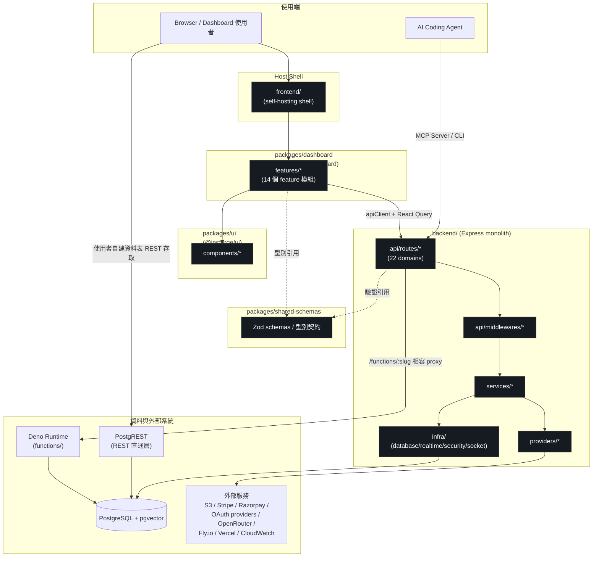

# InsForge — 程式碼地圖

> 來源 commit：`main`@`0dd55c5`。詳細 trace 依據見 [`_context/recon.md`](./_context/recon.md)、[`_context/entry_points.md`](./_context/entry_points.md)、[`_context/extensions.md`](./_context/extensions.md)。

## Annotated Directory Tree

```
InsForge/
├── backend/                          # Express API server（monolith）
│   ├── src/
│   │   ├── server.ts                 # ★ App 組裝點：init 順序、middleware、22 個 route 掛載、graceful shutdown
│   │   ├── api/
│   │   │   ├── routes/                # 22 個 domain 路由群組，每個都是 index.routes.ts + 子路由
│   │   │   │   ├── auth/ database/ storage/ metadata/ logs/ docs/ functions/
│   │   │   │   ├── secrets/ usage/ ai/ memory/ realtime/ email/ deployments/
│   │   │   │   ├── schedules/ payments/(stripe+razorpay) compute/ analytics/
│   │   │   │   └── webscraper/ webhooks/ s3-gateway/ advisor/
│   │   │   └── middlewares/           # auth.ts(verify*) error.ts rate-limiters.ts s3-sigv4.ts upload.ts
│   │   ├── services/                  # 業務邏輯層，對應每個 route 群組，皆為 singleton getInstance()
│   │   ├── providers/                 # 外部 SDK/API 封裝（ai/ payments/ oauth/ storage/ email/ logs/
│   │   │                              #   compute/ deployments/ functions/ webscraper/ analytics/ database/）
│   │   ├── infra/
│   │   │   ├── database/               # DatabaseManager、migrations/（node-pg-migrate + bootstrap/）
│   │   │   ├── realtime/               # RealtimeManager（pg_notify LISTEN）
│   │   │   ├── security/               # TokenManager（JWT/JWKS）、encryption
│   │   │   ├── socket/                 # SocketManager（Socket.IO）
│   │   │   └── config/                 # app.config.ts（env var 讀取與預設值）
│   │   ├── types/ utils/               # 共用型別、sql-parser.ts（libpg-query WASM）、seed.ts、environment.ts
│   │   └── ...
│   ├── scripts/                        # migration 檢查、手動測試腳本
│   └── tests/                          # unit / integration / e2e(cloud/local/manual)
│
├── frontend/                           # self-hosting 用的最小 host shell（掛載 packages/dashboard）
│   └── src/
│       ├── main.tsx App.tsx helpers.ts # 依 isCloudHosting() 分流
│       ├── self-hosting/               # <InsForgeDashboard mode="self-hosting" />
│       └── cloud-hosting/              # partner/iframe 通訊層（云端版才用）
│
├── packages/
│   ├── dashboard/                      # ★ @insforge/dashboard，真正的 dashboard 功能實作（可發佈）
│   │   └── src/
│   │       ├── index.ts                # 對外 entry：匯出 InsForgeDashboard + 型別 contract
│   │       ├── app/InsforgeDashboard.tsx  # App factory + provider tree（Router/QueryClient/Auth/Socket/…）
│   │       ├── features/               # 14 個 feature 模組（ai/analytics/auth/compute/dashboard/database/
│   │       │                           #   deployments/functions/login/logs/payments/realtime/storage/
│   │       │                           #   visualizer/webscraper），各自 components/hooks/services/pages
│   │       ├── navigation/menuItems.ts # ★ 側邊選單手動註冊清單
│   │       ├── router/                 # AppRoutes、RequireAuth
│   │       └── lib/                    # apiClient、runtime config
│   ├── ui/                             # @insforge/ui 設計系統元件庫
│   │   └── src/{components/,lib/,index.ts,styles.css}  # 兩層 barrel export
│   ├── ui/tailwind-preset.js           # 共用 Tailwind preset（design tokens）
│   └── shared-schemas/                 # @insforge/shared-schemas，前後端共用 Zod schema/型別（★ 契約源頭）
│
├── functions/                          # Deno edge functions runtime（使用者擴充主戰場）
│   ├── server.ts                       # Deno.serve 入口，slug dispatch、secrets 解密、worker 建立
│   ├── worker-template.js              # 沙箱執行殼（Deno.env/process.env 鎖死）
│   └── examples/                       # demo-hello-world.js、demo-whoami.js 等範例
│
├── docs/                               # Mintlify 產品文件（面向使用者，非程式碼架構文件）
├── openapi/                            # 由 shared-schemas 產生的 OpenAPI 輸出
├── deploy/                             # docker-compose 變體、DB bootstrap SQL、Zeabur 設定
├── .agents/docs/, .claude/skills/, .codex/skills/   # AI coding agent 用的操作指南與 skills
├── .internal/docs/                     # 內部維運文件（audits/plans/specs，非公開）
├── examples/                           # 範例應用（oauth、python-ml-experiment-tracker）
└── scripts/                            # repo 層級維護腳本（skill 同步等）
```

## 「我想改 X 要看哪裡？」速查表

| 我想要... | 看這裡 | 關鍵檔案 |
|---|---|---|
| 新增一個 backend API endpoint | `backend/src/api/routes/<domain>/` + `services/` + `server.ts` | `index.routes.ts`、對應 `*.service.ts`、`server.ts`（手動 import + mount） |
| 修改前後端共用的資料型別/驗證規則 | `packages/shared-schemas/src/` | 對應 domain 的 Zod schema 檔，再回頭改 consumer |
| 新增一個 OAuth 登入 provider | `backend/src/providers/oauth/` | `base.provider.ts`（interface）、`index.ts`（barrel）、`<vendor>.provider.ts` |
| 新增一個金流 provider | `backend/src/providers/payments/`、`services/payments/`、`api/routes/payments/` | 無共用 interface，仿 `stripe.provider.ts`/`razorpay.provider.ts` 寫法 + `types/payments.ts` 的 `PaymentProvider` union |
| 修改資料庫 schema（新增系統表） | `backend/src/infra/database/migrations/` | 新增編號遞增的 `.sql` 檔，`npm run migrate:create`／`migrate:up` |
| 修改動態建表/PostgREST 同步邏輯 | `backend/src/services/database/` | `database-table.service.ts`、`database-advance.service.ts`（`NOTIFY pgrst, 'reload schema'`） |
| 新增/修改 dashboard 頁面功能 | `packages/dashboard/src/features/<name>/` | `components/`、`hooks/`、`services/`、`pages/`，並在 `navigation/menuItems.ts` 註冊 |
| 新增一個共用 UI 元件 | `packages/ui/src/components/` | 新檔案 + `components/index.ts` + `src/index.ts` 兩層 barrel |
| 調整全站樣式/design token | `packages/ui/tailwind-preset.js`、`packages/ui/src/styles.css` | Tailwind preset + CSS variable |
| 修改 middleware（認證/rate limit/上傳） | `backend/src/api/middlewares/` | `auth.ts`、`rate-limiters.ts`、`upload.ts`、`s3-sigv4.ts`、`error.ts` |
| 調整 Docker/自架部署設定 | 根目錄 + `deploy/` | `docker-compose*.yml`、`Dockerfile`、`deploy/docker-init/db/` |
| 新增/修改邊緣函式（給終端使用者） | `functions/` | 使用者自寫 `module.exports = async function(request){}`，透過 dashboard/API 部署，不需碰本 repo 原始碼 |
| 修改邊緣函式沙箱安全機制 | `functions/worker-template.js`、`functions/server.ts` | Worker 權限白名單、`Deno.env` shadow 邏輯 |
| 調整環境變數/設定載入 | `backend/src/infra/config/app.config.ts`、根目錄 `.env.example` | `appConfig.*` |
| 修改 realtime/pub-sub 行為 | `backend/src/infra/realtime/`、`backend/src/infra/socket/` | `realtime.manager.ts`（pg_notify）、`socket.manager.ts`（Socket.IO） |
| 修改 CI/CD | `.github/workflows/` | GitHub Actions YAML |
| 新增 e2e 測試 | `backend/tests/` | `tests/integration/`、`tests/run-all-tests.sh` |

## 模組依賴關係圖



> 圖中 `PostgREST` 與 `backend Express app` 是**兩條並存的資料存取路徑**（詳見 [`_context/data_flow.md`](./_context/data_flow.md)），並非上下游關係——這是本專案架構上一個容易誤解的地方，於 `ARCHITECTURE.md` 進一步說明。
