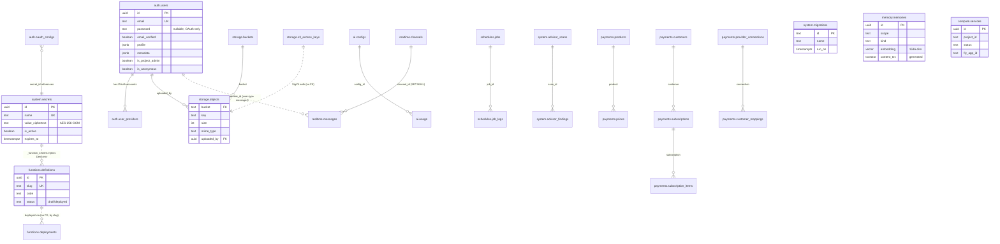
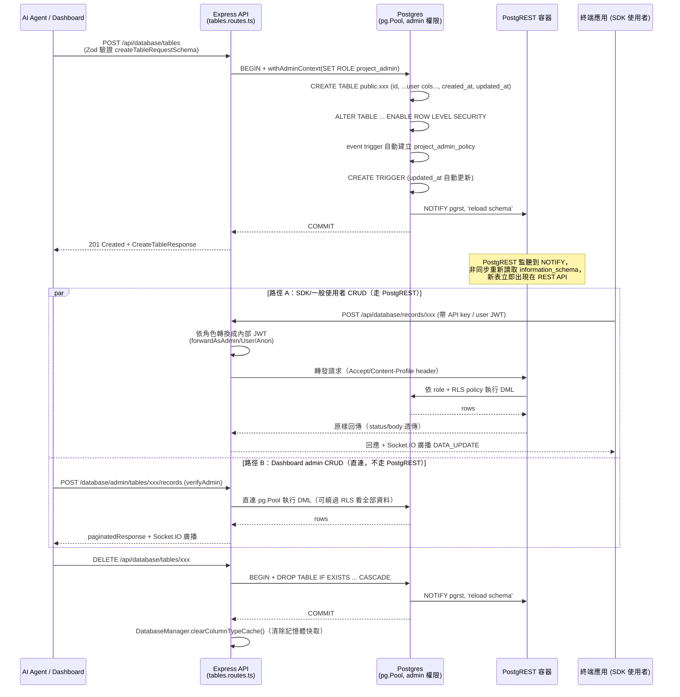

# InsForge 資料模型文件 (DATA_MODEL)

> Trace 產出，來源 commit: `main`（見 `.trace/TRACE_META.md`）。本文件基於
> `.trace/_context/recon.md`、`data_flow.md`、`core_logic.md`、`configuration.md`
> 四份 Stage 2 產出，並直接讀取 `backend/src/infra/database/migrations/` 下 62 個
> migration `.sql` 檔（`000`~`059`，含兩個重複編號 `033`/`047`）交叉驗證。

## 0. 核心概念：兩層資料模型

InsForge 作為 BaaS 平台，資料庫裡實際上疊了兩層完全不同性質的 schema：

| 層級 | Schema | 建立方式 | 可窮舉性 | 本文件涵蓋方式 |
|---|---|---|---|---|
| **(a) 平台自身系統表** | `system` / `auth` / `storage` / `ai` / `functions` / `realtime` / `schedules` / `payments` / `compute` / `memory` / `email` / `deployments` | `node-pg-migrate` 版本控管的 SQL migration，隨 InsForge 版本演進 | **可窮舉**（本文件第 2 節逐一列出） | 直接讀 migration SQL 摘要 |
| **(b) 使用者動態建立的資料表** | `public`（或使用者自訂 schema，見 `056_expose-custom-schemas-to-postgrest.sql`） | Agent/開發者透過 `POST /api/database/tables` 或 dashboard UI 在**執行期**動態 `CREATE TABLE` | **不可窮舉**（每個 project 的 schema 都不同） | 說明其建立/管理**機制**（第 5、6 節），不列具體表 |

這個切分本身就是 InsForge 最核心的資料模型設計：**用一組固定的 `system`-family schema 管理平台自己的狀態，同時把 `public` schema 完全讓渡給使用者，透過 PostgREST 把「使用者自建的任意 schema」自動變成 REST API**。

---

## 1. 命名與 schema 演進小史（⚠️ 有助理解為何 migration 檔案裡有大量 rename）

早期（`000`~`017`）所有系統表都建在 `public` schema，用底線前綴命名（`_user`、`_secrets`、`_account`…）以跟使用者資料表區隔。`018_schema-rework.sql`（642 行，全專案最大規模的單一 migration 之一）把這些表**搬遷並改名**到專屬 schema：

- `public._secrets` → `system.secrets`
- `public._audit_logs` → `system.audit_logs`
- `public._mcp_usage` → `system.mcp_usage`
- `public._accounts`（原 `_user`）→ `auth.users`
- `public._account_providers`（原 `_account`/`_oauth_connections`）→ `auth.user_providers`
- `public._auth_configs` → `auth.configs`
- `public._oauth_configs` → `auth.oauth_configs`
- `public._email_otps` → `auth.email_otps`
- `public._ai_configs`/`_ai_usage` → `ai.configs`/`ai.usage`
- `public._storage_buckets`/`_storage` → `storage.buckets`/`storage.objects`
- `public._functions` → `functions.definitions`

同時把 `public.users`（人類可讀 profile 表，`003_create-users-table.sql`）的資料併入 `auth.users.profile`（JSONB）後整表刪除、把 `public.uid()/role()/email()` helper function 換成 `auth.uid()/role()/email()`。這代表：**`public` schema 目前只保留給使用者資料表**，平台系統表全部搬進具語意的專屬 schema，`system.migrations` ledger 表本身也在此之前由 `bootstrap-migrations.js` 特殊處理搬到 `system` schema（見第 4 節）。

---

## 2. 系統表清單（`system`-family schemas，依 domain 分組）

以下逐一列出目前（`059` 為止）由 migration 建立的系統表，格式：`schema.table`（首次建立/最後定案的 migration 檔）。

### 2.1 `system` schema — 平台核心/維運

| 表 | 關鍵欄位 | 說明 |
|---|---|---|
| `system.migrations` | `id`, `name`, `run_on` | `node-pg-migrate` 版本控管 ledger，由 bootstrap 腳本從 `public._migrations` 搬入（見第 4 節） |
| `system.secrets` | `id UUID`, `name TEXT UNIQUE`, `value_ciphertext TEXT`, `is_active`, `last_used_at`, `expires_at` | AES-256-GCM 加密的通用 secret store（`008_add-system-tables.sql`，後由 `011`/`035` 重構去重）。同時存 `API_KEY`/`ANON_KEY`/`JWT_PRIVATE_KEY` 等系統自身金鑰 |
| `system.audit_logs` | `actor`, `action`, `module`, `details JSONB`, `ip_address INET` | 管理操作稽核（`008_add-system-tables.sql`） |
| `system.mcp_usage` | `tool_name`, `success`, `created_at` | MCP tool 呼叫次數統計（`000_create-base-tables.sql`） |
| `system.deployments` | `provider`(預設`vercel`), `provider_deployment_id`, `status`, `url`, `metadata JSONB` | 網站部署（provider-agnostic 設計，`019_create-deployments-table.sql`） |
| `system.custom_migrations` | `version TEXT PRIMARY KEY CHECK(~'^[0-9]{14}$')`, `name`, `statements TEXT[]` | 使用者透過 database migration 功能自訂的 SQL migration 記錄（`032_create-custom-migrations.sql`，與 `033_relax-custom-migrations-version-check.sql` 放寬版本格式） |
| `system.database_backups` | `trigger_source`('manual'/'scheduled'), `status`, `storage_key`, `size_bytes` | 自架 `pg_dump` 備份的中繼資料，實際檔案走 storage provider（`051_create-database-backups.sql`） |
| `system.advisor_scans` / `system.advisor_findings` | `status`, `scan_type`, `severity CHECK(critical/warning/info)`, `category CHECK(security/performance/health)` | Database advisor 掃描結果（`057_create-database-advisor.sql`），`059` 額外建 `advisor_suppressions` 表供使用者忽略特定 finding |

### 2.2 `auth` schema — 使用者認證

| 表 | 關鍵欄位 | 說明 |
|---|---|---|
| `auth.users` | `id UUID PK`, `email UNIQUE`, `password`(nullable, OAuth-only 可空), `email_verified`, `profile JSONB`, `metadata JSONB`, `is_project_admin BOOLEAN`, `is_anonymous BOOLEAN`, `created_at`/`updated_at` | 核心使用者表（`000`→`018` 搬遷+改名而成）。`profile` 存 name/avatar_url/bio/birthday 等公開資料；`metadata` 保留給系統用（device id、login ip）。啟用 RLS：任何人可 SELECT `(id, profile, created_at)`，僅本人可 UPDATE `profile` |
| `auth.user_providers` | `user_id FK→auth.users`, `provider`, `provider_account_id`, `access_token`, `refresh_token`, `provider_data JSONB`, `UNIQUE(provider, provider_account_id)` | OAuth 連結帳號（原 `_account`/`_oauth_connections`） |
| `auth.configs` | 單例表（`UNIQUE INDEX ((1))`），`require_email_verification`, `password_min_length CHECK(4~128)`, `require_number/lowercase/uppercase/special_char`, `verify_email_redirect_to`, `reset_password_redirect_to` | 全域密碼/驗證政策（`015`，`042_add-disable-signup-flag.sql` 加 `disable_signup`） |
| `auth.email_otps` | `email`, `purpose`, `otp_hash`(bcrypt 或 SHA-256 雙策略), `expires_at`, `consumed_at`, `attempts_count`, `UNIQUE(email, purpose)` | Email OTP／magic link 驗證（`015`），6 碼數字用 bcrypt（防暴力破解）、64 字元 token 用 SHA-256（O(1) 直接查表） |
| `auth.oauth_configs` | `provider UNIQUE`, `client_id`, `secret_id FK→system.secrets`, `scopes TEXT[]`, `redirect_uri`, `use_shared_key BOOLEAN` | 每個 OAuth provider 的設定（`008`→`018` 搬遷） |
| `auth.custom_oauth_configs` | ⚠️ 未逐行讀取（`026_create-custom-oauth-configs.sql`），推測供使用者自訂 OAuth app（非 InsForge 內建 6+ provider）之用 |

### 2.3 `storage` schema — 物件儲存

| 表 | 關鍵欄位 | 說明 |
|---|---|---|
| `storage.buckets` | `name TEXT PK`, `public BOOLEAN` | Bucket 層級設定（原 `_storage_buckets`） |
| `storage.objects` | `bucket FK→buckets(name) CASCADE`, `key`, `size`, `mime_type`, `uploaded_by FK→auth.users SET NULL`, `PK(bucket,key)` | 檔案物件（原 `_storage`），`012_add-storage-uploaded-by.sql` 加上傳者欄位；`034`/`052` 擴充 S3 protocol 相容欄位（CORS/tagging/versioning）；`046` 轉移公開物件的擁有權 |
| `storage.s3_access_keys` | `access_key_id UNIQUE`, `secret_access_key_encrypted`(可逆加密，因 SigV4 驗簽需明文重算 HMAC), `last_used_at` | S3 相容協定的存取金鑰（`033_create-s3-access-keys.sql`） |
| `storage.object_tags` | ⚠️ 未逐行讀取（`036_storage-third-party-auth-support.sql`附近），推測物件的 key-value tag |
| `storage.config` | ⚠️ 未逐行讀取（`025_create-storage-config-table.sql`），推測儲存全域設定（如預設 provider） |

### 2.4 `ai` schema — AI Gateway

| 表 | 關鍵欄位 | 說明 |
|---|---|---|
| `ai.configs` | `modality`, `provider`, `model_id UNIQUE`, `system_prompt` | AI 模型設定（原 `_ai_configs`，`010`/`020`/`023` 陸續加 modality 種類與 soft delete，`043` 又清掉部分 deprecated 欄位/表） |
| `ai.usage` | `config_id FK→ai.configs`, `input_tokens`, `output_tokens`, `image_count`, `image_resolution` | Token/用量統計（原 `_ai_usage`） |

### 2.5 `functions` schema — Edge Functions（Deno）

| 表 | 關鍵欄位 | 說明 |
|---|---|---|
| `functions.definitions` | `slug UNIQUE`, `name`, `description`, `code TEXT`, `status`(預設`draft`), `deployed_at` | 使用者自訂 Deno function 原始碼與狀態（原 `_edge_functions`→`_functions`） |
| `functions.deployments` | `id TEXT PK`(= Deno Deploy deployment_id), `project_id`, `status`(pending/success/failed), `functions JSONB`, `build_logs JSONB` | Deno Deploy 部署歷史（`022_create-function-deployments.sql`） |

平台自身還有 `_function_secrets`（`009_add-function-secrets.sql`，`key UNIQUE`, `value_ciphertext`, `is_reserved`）：加密後注入 edge function 執行環境當 `Deno.env` 變數，⚠️ 未確認是否也在 `018` 之後搬進 `functions` schema（migration list 中未見對應搬遷語句，可能仍留在 `public` 或已改名，需進一步驗證）。

### 2.6 `realtime` schema — pg_notify → Socket.IO/Webhook

| 表 | 關鍵欄位 | 說明 |
|---|---|---|
| `realtime.channels` | `pattern UNIQUE`(支援 `:`/`%` wildcard), `webhook_urls TEXT[]`, `enabled` | 頻道定義；RLS SELECT policy = 「訂閱權限」 |
| `realtime.messages` | `event_name`, `channel_id FK→channels SET NULL`, `channel_name`(denormalized), `payload JSONB`, `sender_type CHECK(system/user)`, `sender_id`, `ws_audience_count`, `wh_audience_count`, `wh_delivered_count` | 所有即時訊息落地記錄；RLS INSERT policy = 「發布權限」。`024_add-realtime-message-retention.sql` 加訊息保留期限機制 |
| `realtime.config` | ⚠️ 未逐行讀取，推測全域 realtime 設定 |

`053_fix-realtime-channel-name-helper.sql` 修正 channel name 比對的 helper function（⚠️ 細節未讀）。

### 2.7 `schedules` schema — Cron Jobs（依賴 `pg_cron`/`http`/`pgcrypto` extension）

| 表 | 關鍵欄位 | 說明 |
|---|---|---|
| `schedules.jobs` | `name`, `cron_schedule`, `function_url`, `http_method`, `encrypted_headers`, `headers JSONB`, `body JSONB`, `is_active`, `cron_job_id BIGINT`(對應 `pg_cron.job.jobid`), `last_executed_at` | Cron job 定義，實際排程委由 Postgres 原生 `pg_cron` extension 執行 |
| `schedules.job_logs` | `job_id FK→jobs CASCADE`, `executed_at`, `status_code`, … | 執行歷史（`037_schedules-http-timeout.sql` 加逾時控制） |
| `schedules.config` | ⚠️ 未逐行讀取，推測全域排程設定 |

### 2.8 `payments` schema — 雙 provider 金流（Stripe + Razorpay，`039`/`040`/`049` 三次大規模擴充）

`039_create-payments-schema.sql`（15KB）先建：`stripe_connections`、`products`、`prices`、`stripe_customer_mappings`、`checkout_sessions`、`customer_portal_sessions`、`payment_history`、`subscriptions`、`subscription_items`、`webhook_events`。`040_create-payments-customers-table.sql` 補 `customers` 表。`049_add-multi-provider-payments-foundation.sql`（**全 repo 最大 migration，40KB**）把架構從「單 Stripe」重構成「多 provider」：加入 `payments.provider_connections`（取代/擴充 `stripe_connections`）、`payments.customer_mappings`（取代 `stripe_customer_mappings`）、以及 Razorpay 專屬的 `razorpay_orders`/`razorpay_plans`/`razorpay_subscriptions`/`razorpay_items`。⚠️ 具體欄位未逐一讀取，但可判斷此 schema 是 InsForge 內對接外部金流 SaaS（Stripe/Razorpay）的**鏡像/快取層**：webhook 事件驅動同步（`webhook_events` 表）、業務資料以 provider 的物件模型（product/price/subscription/checkout session）對映儲存，符合一般 SaaS 金流整合的標準做法。

### 2.9 `compute` schema — Fly.io 容器部署

| 表 | 關鍵欄位 | 說明 |
|---|---|---|
| `compute.services` | `project_id`, `name`, `image_url`, `port CHECK(1~65535)`, `cpu`(預設`shared-1x`), `memory`(預設512), `env_vars_encrypted`, `region`(預設`iad`), `fly_app_id`, `fly_machine_id`, `status CHECK(creating/deploying/running/stopped/failed/destroying)`, `endpoint_url`, `UNIQUE(project_id,name)` | 使用者部署的 Docker 容器服務中繼資料，實際運算資源由 Fly.io 代管（`038`，`047_compute-services-add-protocol.sql`/`058_compute-services-add-scale-to-zero.sql` 陸續加 protocol 與 scale-to-zero 支援） |

### 2.10 `memory` schema — Agent 語意記憶（pgvector）

| 表 | 關鍵欄位 | 說明 |
|---|---|---|
| `memory.memories` | `scope`, `kind CHECK(fact/decision/preference/reference)`, `title`, `content`, `embedding VECTOR(1536)`, `embedding_model`(預設`openai/text-embedding-3-small`), `content_tsv TSVECTOR GENERATED`(全文檢索) | 給 AI coding agent 用的持久記憶儲存，支援 **hybrid search**：HNSW index 做語意（cosine）近似搜尋 + GIN index 做關鍵字全文檢索。這是 InsForge「給 agent 用的 backend」定位在資料模型層最直接的體現（`050_create-memory-schema.sql`），依 `scope` 做邏輯分區（project/agent/end-user） |

### 2.11 `email` schema — 交易信

| 表 | 關鍵欄位 | 說明 |
|---|---|---|
| `email.config` | ⚠️ 未逐行讀取，推測存 SMTP 主機/帳密設定 | `029_create-smtp-config-and-email-templates.sql` |
| `email.templates` | ⚠️ 未逐行讀取，推測存驗證信/重設密碼信等樣板；`030` 把樣板變數 `code` 改名為 `token` | 同上 |

### 2.12 `deployments` schema — 網站部署檔案

| 表 | 關鍵欄位 | 說明 |
|---|---|---|
| `deployments.files` | ⚠️ 未逐行讀取（`031_create-deployment-files.sql`），推測存放靜態網站部署的檔案清單/內容雜湊，與 `system.deployments` 的部署紀錄搭配使用 |

⚠️ 未驗證清單（本節）：`auth.custom_oauth_configs`、`storage.object_tags`、`storage.config`、`realtime.config`、`schedules.config`、`email.config`、`email.templates`、`deployments.files`、`payments.*` 系列的完整欄位皆只確認表存在與大致用途，未逐行讀取欄位定義。`_function_secrets` 是否已搬遷到 `functions` schema 未確認。

---

## 3. ER Diagram — 系統表關聯（`system`-family schemas）



> 註：多數系統表之間**刻意不建 FK**（例如 `functions.definitions` 與 `functions.deployments` 用 `slug`/`project_id` 鬆散關聯，`storage.s3_access_keys` 與 `storage.objects` 完全無關聯，只在 request-time 做 SigV4 驗簽），反映這些子系統多是「獨立子服務 + 各自的中繼資料表」，而非高度正規化的單一資料模型。`memory.memories` 與 `payments.*` 系列因未逐行讀取欄位，圖中關聯為推測（依 domain 常識與表名對應），標記 ⚠️ 未完全驗證。

---

## 4. Migration 機制：`node-pg-migrate` + Bootstrap/Baseline

### 4.1 基本執行方式

`backend/package.json` 定義：
```
migrate:up:local  = dotenv -e ../.env -- npm run migrate:bootstrap
                     && dotenv -e ../.env -- node-pg-migrate up
                       --migrations-dir src/infra/database/migrations
                       --migrations-schema system
                       --migrations-table migrations
migrate:down:local = dotenv -e ../.env -- node-pg-migrate down ...
```
`node-pg-migrate` 用**純數字前綴 `.sql` 檔名**（`000_xxx.sql` ~ `059_xxx.sql`）當版本順序，ledger 表固定在 `system.migrations`。Docker Compose 啟動流程（見 `configuration.md` 第 7 節）在容器啟動時會先跑 `migrate:up` 再啟動 backend server。

### 4.2 `bootstrap-migrations.js` — migration 執行前的前置腳本

檔案：`backend/src/infra/database/migrations/bootstrap/bootstrap-migrations.js`（193 行）。**必須在 `node-pg-migrate` 之前**執行，原因是 `node-pg-migrate` 在跑任何 migration 前就會先找 ledger table；若把 ledger 表的搬遷寫在某個 migration 檔內，`node-pg-migrate` 會先在 `system` schema 找不到 ledger、誤判成全新安裝、自己建一個空表，導致所有既有 migration 被當成 pending 重跑一次。

職責二項：

1. **相容性搬遷**：偵測 `public._migrations` 是否存在但 `system.migrations` 不存在，若是則在 transaction 內 `ALTER TABLE ... SET SCHEMA` + `RENAME TO` 搬遷（`:123-140`）。
2. **安全防呆（`shouldRefuseReplay`，純函式，`:50-52`，已附 unit test hook）**：
   ```js
   function shouldRefuseReplay({ ledgerTableExists, ledgerRowCount, schemaProvisioned }) {
     return Boolean(ledgerTableExists) && ledgerRowCount === 0 && Boolean(schemaProvisioned);
   }
   ```
   判斷依據 `PROVISIONED_SCHEMA_MARKERS = ['auth.users', 'system.secrets', 'storage.objects']`（`:37`）：若這三張表任一存在（代表資料庫**曾經**被完整 migrate 過），但 `system.migrations` ledger 是空的 —— 典型情境是「從不含 `system` schema 的備份還原資料庫」——直接 `process.exit(1)` 拒絕啟動，並印出詳細補救指引（要求跑 `npm run migrate:baseline` 或用含 `system` schema 的完整 `pg_dump` 還原）。這個防呆存在的原因是：`018_schema-rework.sql` 等 migration **非幂等**（會 rename/DROP 表），若在已建置完成的資料庫上重跑會直接損毀資料。

### 4.3 `baseline-migrations.js` — 手動「蓋章」ledger

⚠️ 未完整讀取全文，只掃到 `readMigrationNames`/`baselineMigrations` 函式簽名。依 `bootstrap-migrations.js` 錯誤訊息（`:84-85`）推斷：用於「同版本還原/分支」場景，把 `system.migrations` ledger 直接標記成「所有現有 migration 檔案都已套用」，而**不實際重跑 SQL**——本質是給 DBA/維運手動修復 ledger 狀態用的工具，跟 bootstrap 的自動判斷是互補關係（bootstrap 偵測問題並中止，baseline 是使用者確認後執行的修復動作）。

### 4.4 小結：三層 migration 治理

| 層 | 何時執行 | 做什麼 | 是否可重跑 |
|---|---|---|---|
| bootstrap | 每次啟動、`node-pg-migrate` 之前 | ledger 表搬遷 + 一致性檢查 | 是（純檢查，冪等） |
| `node-pg-migrate up` | bootstrap 通過後 | 依序套用 `000`~`059` 未跑過的 SQL | 否（每個檔案只跑一次，部分檔案非冪等） |
| baseline | 人工介入，異常恢復時 | 把 ledger 蓋章成「已跑過」而不執行 SQL | 是（管理操作） |

---

## 5. 使用者動態建表機制（`public` schema，不可窮舉）

InsForge 讓使用者（或 AI agent）在**執行期**透過 API 建立任意資料表，這是全平台獨有機制，摘要如下（詳見 `core_logic.md` 第 1 節與 `data_flow.md` 主線）：

- 入口：`POST /api/database/tables` → `DatabaseTableService.createTable()`（`backend/src/services/database/database-table.service.ts:140-322`），僅 `project_admin` 可呼叫。
- 系統強制保留欄位：每張使用者資料表一律自動附加 `id UUID PK DEFAULT gen_random_uuid()`、`created_at`、`updated_at`（`updated_at` 由 `system.update_updated_at()` trigger 自動維護），使用者無法用同名不同型別的欄位覆蓋這三個保留欄位（`validateReservedFields()`）。
- Identifier／型別安全：`validateIdentifier()`/`validateSchemaName()` 過濾 SQL injection 與保留字；欄位型別對照表 `COLUMN_TYPES`（`backend/src/types/database.ts`，例如 `STRING→TEXT`、`DATETIME→TIMESTAMPTZ`）把 InsForge 自訂型別列舉轉成 SQL type；`DEFAULT` 值只白名單放行 `now()`/`gen_random_uuid()` 兩個函式呼叫，其餘一律 dollar-quote 逸出成字面常數，避免函式呼叫注入。
- 預設 `ENABLE ROW LEVEL SECURITY`（`use_RLS` 參數，預設 `true`），並靠 `system.create_default_policies()`/`system.create_policies_after_rls()` 兩個 **event trigger**（`018_schema-rework.sql:372-434`，掛在 `ddl_command_end` on `CREATE TABLE`/`ALTER TABLE`）自動幫每張新表補上 `project_admin_policy`（`FOR ALL TO project_admin USING (true) WITH CHECK (true)`），確保 admin 永遠能繞過使用者自訂的 RLS policy 存取資料。
- 使用者可額外用「schema 管理」功能建立自訂 schema（非 `public`），`056_expose-custom-schemas-to-postgrest.sql` 讓這些自訂 schema 也能被 PostgREST 透過 `Accept-Profile`/`Content-Profile` header 存取。

---

## 6. 資料生命週期：以「使用者建立一張資料表」為例



**關鍵設計要點**：

1. **建立**：DDL 全部由 Express + `pg.Pool` 直連執行（非 ORM，手刻 SQL 字串 + identifier quoting），並非透過 PostgREST。
2. **PostgREST schema reload**：因為 PostgREST 是一個獨立進程，會快取自己讀到的 Postgres schema 用來產生路由，InsForge 自己執行的 DDL 不會被它自動感知，所以**每一個會改變 schema 的操作**（建表/改表/刪表/raw SQL 偵測到 DDL/DB restore/migration apply，見 `core_logic.md` 1.3 節列出的 4 個檔案 8 處呼叫點）都要手動 `NOTIFY pgrst, 'reload schema'`。這是 Postgres 原生 `LISTEN/NOTIFY` pub-sub 機制，PostgREST 內建監聽 `pgrst` channel。
3. **讀寫走兩條路徑**：
   - **PostgREST proxy**（`/api/database/records/:tableName`）：給終端 SDK/一般使用者用，Express 幾乎不碰 SQL，只做「身份轉換 JWT → 轉發 → 透傳回應」，權限完全交給 Postgres RLS + role。
   - **Admin 直連**（`/api/database/admin/tables/:tableName/records`）：Dashboard 專用，Express 直接執行 SQL，可能繞過 RLS 取得管理視角，支援搜尋/排序/分頁/CSV 匯出等 dashboard 特有功能。
4. **刪除**：`DROP TABLE ... CASCADE` + 同樣的 `NOTIFY pgrst`，並清除 `DatabaseManager` 記憶體內的 `columnTypeCache`（TTL 5 分鐘，FIFO bounded 100 entries）避免快取殘留已刪除表的型別資訊。
5. **兩個資料存取入口共用同一個 Postgres 資料庫**（見 `docker-compose.yml`），差異只在「誰跑 SQL、誰做權限判斷」；`NOTIFY/LISTEN` 是讓兩者 schema 認知保持同步的**唯一機制**。

---

## 7. 前端 State Management 策略（`packages/dashboard`）

摘要（詳見 `data_flow.md` 「Frontend 追蹤」章節，非本文件重點，故僅簡述）：

- Dashboard 一律透過 `packages/dashboard/src/lib/api/client.ts` 的 `ApiClient`（包裝 `fetch`，非 axios）存取後端，內建 30 秒 timeout、CSRF token（cookie-based）、401 自動 refresh + 重試一次。
- Server state 全面用 **`@tanstack/react-query`**：每個 feature 目錄下的 `*.service.ts`（API 呼叫）+ `hooks/use*.ts`（React Query hook）成對出現。典型模式：
  - `useQuery({queryKey, queryFn, staleTime})` 讀取（例如 `useTables()` staleTime 2 分鐘）。
  - `useMutation({mutationFn, onSuccess: () => queryClient.invalidateQueries(...) + toast, onError: () => toast})` 寫入，採「mutate → invalidate cache → toast」模式，**不做 optimistic update**。
- Query key 依 feature 命名空間管理（如 `databaseTableQueryKeys.tables(schemaName)`），確保 invalidate 精準命中對應快取。
- 前後端共用 `@insforge/shared-schemas` 的 Zod schema 同時作為 runtime validation（後端）與 TypeScript 型別來源（前端 `z.infer`），避免手動同步兩份 request/response 型別定義。
- Client state（非 server state，如 UI 開關、表單暫存）⚠️ 未在本次 trace 範圍內深入，推測是標準 React `useState`/`useContext`（未驗證是否引入額外的 client state 函式庫如 Zustand/Redux）。

---

## 8. 待驗證事項總表（⚠️）

- `auth.custom_oauth_configs`、`storage.object_tags`、`storage.config`、`realtime.config`、`schedules.config`、`email.config`、`email.templates`、`deployments.files` 的完整欄位定義未逐行讀取。
- `payments.*` 系列（10+ 張表，`039`/`040`/`049`）的完整欄位與 FK 關聯未逐一確認，ER diagram 中對應部分為依 domain 常識推測。
- `_function_secrets` 是否已隨 `018` schema rework 搬進 `functions` schema，或仍留在 `public`，未找到對應搬遷語句確認。
- `baseline-migrations.js` 完整內容未讀取，僅依函式簽名與呼叫端錯誤訊息推斷其行為。
- Postgres container 啟動指令帶的 `app.encryption_key` GUC（供 pgcrypto 用）與 Node 端 `EncryptionManager`（AES-256-GCM）是否為同一套加密機制或各自獨立，未驗證（見 `configuration.md` 第 4 節）。
- 前端 client state（非 server state）管理方式未深入確認。
