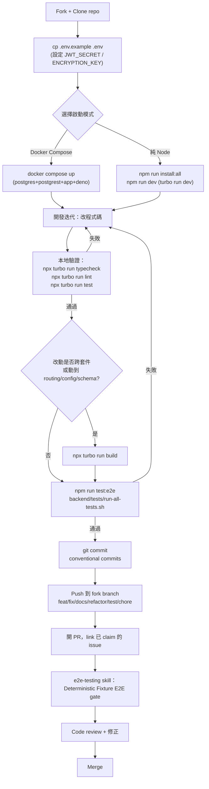

# InsForge 開發者上手指南 (DEV_GUIDE)

> Trace 產出，來源 commit: `main`@`0dd55c5`。本文彙整 `.trace/_context/recon.md`、`.trace/_context/configuration.md`、`.trace/_context/web_findings.md`，並交叉核對 `CONTRIBUTING.md`、`.claude/skills/insforge-dev/`、`README.md`、根 `package.json`、`backend/package.json` 原始檔內容。
>
> 適用對象：要在 InsForge monorepo 本身（backend / packages/dashboard / packages/ui / packages/shared-schemas / frontend）貢獻程式碼的開發者。若你是「用 InsForge 當後端」的應用開發者，請改看 `docs/`（產品文件），本文不涵蓋那個情境。

---

## 目錄

1. [Prerequisites 與環境建置](#1-prerequisites-與環境建置)
2. [本地開發 Workflow](#2-本地開發-workflow)
3. [測試策略與執行方式](#3-測試策略與執行方式)
4. [Debugging 技巧與常見踩坑](#4-debugging-技巧與常見踩坑)
5. [Contribution Workflow](#5-contribution-workflow)
6. [相依性管理與更新策略](#6-相依性管理與更新策略)

---

## 1. Prerequisites 與環境建置

### 1.1 必要工具

| 工具 | 用途 | 來源 |
|---|---|---|
| [Docker](https://www.docker.com/get-started) | 跑 Postgres / PostgREST / Deno / app 容器 | `CONTRIBUTING.md` |
| [Node.js](https://nodejs.org/)（建議 LTS） | 跑 backend/frontend workspace、Turborepo | `CONTRIBUTING.md` |
| `npm@11.3.0`（`packageManager` 欄位鎖定） | monorepo 套件管理 | `package.json:80` |

⚠️ 未驗證：repo 沒有明確標註 Node.js 最低版本需求（無 `engines` 欄位），`backend/package.json` 的 `@types/node` 是 `^20.11.24`，可推測目標為 Node 20+，但未見官方文件明講。

### 1.2 Step-by-step 建置流程

```bash
# 1. Fork 並 clone
git clone https://github.com/InsForge/InsForge.git
cd insforge

# 2. 準備環境變數
cp .env.example .env     # Unix
# copy .env.example .env  # Windows

# 3. 啟動（見第 2 節，Docker Compose 或純 Node 兩種模式擇一）
docker compose up
```

`.env.example`（315 行）分區摘要（詳見 `.trace/_context/configuration.md` 第 3 節）：

- **必填**：`JWT_SECRET`（需 ≥32 字元）。
- **強烈建議設定**：`ENCRYPTION_KEY`（未設定會 fallback 用 `JWT_SECRET`，且輪替 `JWT_SECRET` 時若沒同步設定 `ENCRYPTION_KEY` 會讓既有 secrets 損毀——見 `backend/src/infra/security/encryption.manager.ts:17-23`）。
- 其餘（Ports、AWS/S3、OAuth 六家 provider、Stripe/Razorpay、Fly.io Compute、Deno Deploy）皆為**選填 feature flag**，未設定則對應功能自動停用，不影響核心啟動。

---

## 2. 本地開發 Workflow

InsForge 有兩種本地啟動模式，適合不同開發情境：

| 模式 | 指令 | 適合情境 | 特性 |
|---|---|---|---|
| **Docker Compose**（推薦給新手／驗證完整拓樸） | `docker compose up` | 需要完整多容器拓樸（postgres + postgrest + insforge app + deno）、或只想快速跑起來驗證行為 | 一致環境、免自行裝 Postgres/Deno；但容器內程式碼是啟動時的快照，需注意 volume 掛載是否即時同步（見第 4 節） |
| **純 Node（workspace 原生）** | `npm run install:all && npm run dev` | 日常開發、需要 IDE debugger 直接掛進 Node process、或想要更快的 hot-reload 迭代 | 需自行準備 Postgres/PostgREST/Deno（例如另外只用 Docker 起這幾個依賴服務），但 backend/frontend 的程式碼變更由 `tsx watch` / Vite 直接重新載入，回饋迴圈最短 |

### 2.1 Docker Compose 模式

```bash
git clone https://github.com/InsForge/InsForge.git
cd insforge
cp .env.example .env
docker compose up          # 開發用；正式/預覽環境用 docker compose -f docker-compose.prod.yml up
```

依 recon 對 compose 啟動流程的推斷：容器內會先 `npm install && turbo build`（`shared-schemas`/`ui`/`dashboard`）→ `migrate:up`（含 bootstrap 防呆檢查）→ `concurrently` 同時跑 backend + frontend dev server。

啟動後：開 [http://localhost:7130](http://localhost:7130) 依畫面指示連接 InsForge MCP Server，並可用以下 prompt 驗證安裝：
```
I'm using InsForge as my backend platform, call InsForge MCP's fetch-docs tool to learn about InsForge instructions.
```

多專案並行（同一台機器跑多個 InsForge 實例）：複製 `.env` 為不同檔案（`cp .env.example .env.project1`）、改不同的 `POSTGRES_PORT`/`POSTGREST_PORT`/`APP_PORT`/`AUTH_PORT`/`DENO_PORT`，再用 `-p <project-name>` 區隔 compose project（`README.md` Quickstart 第 4 節）。

### 2.2 純 Node 模式

```bash
npm run install:all   # = npm install && cd backend && npm install && cd ../frontend && npm install
npm run dev            # = turbo run dev（backend + frontend 平行啟動，經 turbo 快取管理）
```

`root package.json` 提供的相關 script（`package.json:11-30`）：

| script | 內容 | 用途 |
|---|---|---|
| `dev` | `turbo run dev` | 透過 Turborepo 平行跑各 workspace 的 dev server |
| `dev:backend` | `cd backend && npm run dev` | 只跑後端（`dotenv -e ../.env -- tsx watch src/server.ts`） |
| `dev:frontend` | `cd frontend && npm run dev` | 只跑前端 Vite dev server |
| `dev:debug` | `concurrently` 同時跑 `dev:backend:debug` + `dev:frontend:debug` | 見第 4 節 DEBUG_MODE |
| `start` / `start:prod` | 跑編譯後的 `dist/server.js` | 驗證 production build |

此模式下 Postgres/PostgREST/Deno runtime **仍需另外提供**（例如只用 `docker compose up postgres postgrest deno`，或自行本機安裝），因為純 Node 模式不會自動起這些依賴服務；`app.config.ts` 對這些外部服務的預設值皆指向 `localhost`（例如 PostgREST 預設 `http://localhost:5430`、Deno runtime 預設 `http://localhost:7133`），與 docker-compose 內部覆寫的 docker network 位址（`http://postgrest:3000`、`http://deno:7133`）不同，混用時容易連錯目標，需注意。

### 2.3 開發 Workflow 流程圖



---

## 3. 測試策略與執行方式

InsForge 的測試分成三層：**unit（Vitest）**、**integration（Vitest，連真實 DB）**、**e2e（shell script 打真實 API + 跨 repo 的 Deterministic Fixture E2E gate）**。

### 3.1 Backend 測試指令（`backend/package.json:14-19`）

| 指令 | 說明 |
|---|---|
| `npm test`（`vitest run`） | 跑全部 Vitest 測試（unit + integration，依 vitest config 涵蓋範圍） |
| `npm run test:watch` | Vitest watch 模式 |
| `npm run test:coverage` | 含 coverage 報告 |
| `npm run test:ui` | Vitest UI |
| `npm run test:integration`（`vitest run --dir tests/integration --testTimeout=30000`） | 只跑 `tests/integration/` 下的整合測試，逾時拉長到 30 秒（因為要打真實資料庫） |
| `npm run test:e2e`（`./tests/run-all-tests.sh`） | 跑完整 e2e shell script 套件，需要一個真正在跑的 backend server（見下） |

根目錄對應：`npm run test`（`turbo run test`，跑所有 workspace 的 test task）、`npm run test:backend`（`cd backend && npm test`）、`npm run test:e2e`（`cd backend && npm run test:e2e`）（`package.json:21-23`）。

### 3.2 `backend/tests/` 目錄用途（依 `backend/tests/README.md` 與 Glob 掃描）

| 子目錄 | 用途 |
|---|---|
| `unit/` | 純 Vitest 單元測試（約 190+ 檔），涵蓋每個 route/service/migration 的邏輯，不需要外部服務即可跑（多為 mock），例如 `unit/app.config.test.ts`、`unit/bootstrap-migrations-guard.test.ts`、`unit/compute/fly-provider.test.ts` |
| `integration/` | 需要連真實 Postgres 的整合測試，例如 `integration/rls.test.ts`（Row-Level Security）、`integration/auth-helpers.test.ts`，透過 `npm run test:integration` 執行，timeout 拉長至 30 秒 |
| `local/` | 針對「本地 Docker 部署 + 本地檔案儲存」情境的 shell script e2e 測試（`test-auth-router.sh`、`test-database-router.sh`、`test-e2e.sh`、`test-storage-rls.sh` 等），需要 backend server 實際跑在 `http://localhost:7130` |
| `cloud/` | 針對「雲端部署 + S3 multi-tenant 儲存」情境的 shell script 測試（`test-s3-multitenant.sh`、`test-s3-gateway.sh`），需要 `AWS_S3_BUCKET` 等 AWS 憑證，未設定時 `run-all-tests.sh` 會自動跳過 |
| `manual/` | 不納入自動化流程、需人工介入或特殊資料準備的測試腳本/SQL（例如 `test-ai-embeddings.sh`、`seed-large-table.sql`、`test-google-id-token.html`），供除錯/效能驗證時手動執行 |

`run-all-tests.sh` 的關鍵行為（見 `backend/tests/run-all-tests.sh:38-79`）：
- 自動從 repo root 的 `.env` load 環境變數。
- 支援 `--preflight-only` 參數，僅做前置條件檢查（`preflight.sh`）後結束，不實際跑測試。
- 若未設定 `ROOT_ADMIN_USERNAME`/`ROOT_ADMIN_PASSWORD`，會用預設值 `admin`/`change-this-password` 並印警告。
- 若未設定 `AWS_S3_BUCKET`，cloud 測試會被跳過（印 Note，不視為失敗）。

跑 e2e 前，backend server 必須已在 `http://localhost:7130` 上線（`TEST_API_BASE` 可覆寫）。

### 3.3 前端 / dashboard 測試

依 `insforge-dev` skill 描述（`.claude/skills/insforge-dev/SKILL.md:44`）：dashboard 前端測試分三層——Vitest unit tests、Vitest component tests、Playwright UI smoke tests。具體指令 ⚠️ 未在本次讀取範圍內驗證（位於 `.claude/skills/insforge-dev/dashboard/SKILL.md`，本文未展開讀取），如需精確指令建議另行查閱該檔案。

### 3.4 跨 repo 的 Deterministic Fixture E2E Gate

這是 PR 前**額外**的 release-quality gate，定義在 `.claude/skills/insforge-dev/e2e-testing/SKILL.md`，不是取代本地 `typecheck`/`lint`/`test`/`build`，而是在那些都過了之後、開 PR 前再跑一次：
1. 依根 `package.json` 版本號 + patch+1 + feature slug 組出 test tag（例如 `v2.2.4-storage-returning-rls`）。
2. 用該 tag dispatch `InsForge/InsForge` repo 的「Build and Push Docker Image」workflow。
3. 判斷本次改動是否需要同步更新 `InsForge/agent-e2e` 的 fixture（API 契約、auth/RLS/storage/realtime/functions/schedules/AI/SDK/CLI 行為變更都需要）。
4. Dispatch `InsForge/agent-e2e` 的「Deterministic Fixture E2E」workflow 並等待結果，失敗需區分是 InsForge 實作 bug、fixture bug 還是暫時性 infra 問題。

---

## 4. Debugging 技巧與常見踩坑

### 4.1 Debug 模式環境變數

| 變數 | 對應 script | 用途 |
|---|---|---|
| `DEBUG_MODE=true` | `npm run dev:backend:debug`（`package.json:15`，用 `cross-env` 注入） | 開啟 backend debug 模式 |
| `VITE_DEBUG_MODE=true` | `npm run dev:frontend:debug`（`package.json:17`） | 開啟前端 debug 模式（Vite build-time 變數） |
| `npm run dev:debug` | 同時用 `concurrently` 跑上述兩者，標色輸出（backend=cyan, frontend=magenta） | 一次開兩邊 debug |

⚠️ 未驗證：這兩個 flag 實際在程式碼內控制哪些行為（例如是否開啟更詳細的 log level），本次 trace 未逐一追蹤 `DEBUG_MODE`/`VITE_DEBUG_MODE` 的讀取點，建議用 `grep -rn "DEBUG_MODE" backend/src frontend/src` 或 `packages/dashboard/src` 進一步確認。

### 4.2 Docker Compose volume 掛載與本地修改不同步

Docker Compose 啟動時容器內程式碼是啟動當下的快照（或透過 volume mount 即時同步，視 compose 檔設定而定）。常見踩坑：
- **開發用 `docker-compose.yml`** 與 **production 用 `docker-compose.prod.yml`** 是不同檔案（`README.md` Quickstart 用的是 `docker-compose.prod.yml`，`CONTRIBUTING.md` 的 Getting Started 直接用不帶 `-f` 的 `docker compose up`，兩者行為可能不同）——⚠️ 未驗證兩份 compose 檔在 volume 掛載策略上的具體差異，建議動手改程式碼前先確認自己跑的是哪一份 compose 檔，避免「明明改了程式碼但容器內行為沒變」。
- 若用純 Node 模式跑 backend/frontend，但資料庫/PostgREST/Deno 是另外用 Docker 起的，切記 `.env` 裡的 `POSTGRES_HOST`/`POSTGREST_BASE_URL`/`DENO_RUNTIME_URL` 預設值是 `localhost` 系列，而 docker-compose 內部會覆寫成 docker network 服務名稱（`postgres`/`postgrest:3000`/`deno:7133`）——混合模式時要自行確認這些變數指向正確的 host。
- Env 載入順序容易混淆：`docker compose environment:` 區塊 > `dotenv-cli`（`npm run dev`/`migrate:*:local`）> `app.config.ts` 內部 dotenv（4 條路徑輪詢）> `server.ts` 內部 dotenv（幾乎是 no-op，因 dotenv 預設不覆寫已存在的 `process.env`）。改了 `.env` 卻沒生效時，先確認是不是被更早生效的來源蓋掉。

### 4.3 Migration 相關踩坑：bootstrap-migrations 防呆機制

`backend/src/infra/database/migrations/bootstrap/bootstrap-migrations.js`（`npm run migrate:bootstrap`，會在 `npm run migrate:up`/`migrate:up:local`/`migrate:redo` 之前自動先跑）有一個關鍵防呆：

- **偵測「schema 已佈建但 ledger 是空的」不一致狀態**：若 `auth.users` / `system.secrets` / `storage.objects` 任一表已存在，但 `system.migrations` ledger table 是空的（典型情境：從備份還原資料庫、但備份沒包含 `system` schema），會直接 `process.exit(1)` 拒絕執行，避免非幂等的 migration（例如會 rename/DROP 表的 migration）重跑造成資料庫損毀。
- **踩到這個防呆時的補救方式**：依錯誤訊息指示執行 `npm run migrate:baseline`（`backend/package.json:21`，對應 `baseline-migrations.js`），把 ledger table「蓋章」成跟現有 migration 檔案一致，而不是實際重跑 SQL——適用於「資料庫還原/分支但 schema 版本其實一致」的場景。
- 舊版 `public._migrations` ledger table 會被自動搬遷到 `system.migrations`（因為 `node-pg-migrate` 若沒搬移，會誤判成全新安裝並在 `system` schema 建空 ledger，導致所有 migration 被當成 pending 重跑）。
- `bootstrap-migrations.js` 需要 `DATABASE_URL` 環境變數才能連線，未設定會直接 `process.exit(1)`。

本地開發若遇到 migration 卡住／報錯，先看是不是誤觸這個防呆機制，而不是急著手動改資料庫。

### 4.4 其他已知落差 / 待驗證點

- `⚠️ 未驗證`：`FunctionService.isSubhostingConfigured()` 的實際判斷式、`frontend/` 如何把 `VITE_API_BASE_URL` 傳遞成 dashboard 的 `host.backendUrl` prop——除錯 OAuth/functions/前端連線問題時可能需要另外追這幾條鏈路。
- README 標示 Compute 為 "private preview"，但程式碼中 `backend/src/services/compute/`、`backend/src/providers/compute/`、`backend/src/api/routes/compute/` 已有完整實作；本地測試 Compute 功能需同時設定 `FLY_API_TOKEN` **與** `FLY_ORG`（兩者缺一則直接報錯），只設一個會導致啟動失敗而非靜默停用。

---

## 5. Contribution Workflow

### 5.1 Issue-first workflow（`CONTRIBUTING.md` 「Claiming an Issue」）

InsForge 採 **issue-first** 流程：

1. 先找或開一個 issue 描述要做的 bug/feature。
2. 在 issue 留言認領（例如 "I'd like to work on this"），維護者 agent **章北海（Zhang Beihai）** 會自動指派（若權限不足則由人工指派）。
   - **每人最多同時 3 個 open assigned issues，跨全部 InsForge repositories 計算**（非單一 repo），要先完成或釋出（留言 "unassign me"）才能認領新的。
3. **等到 issue 真的指派給你**才開 PR，並在 PR 描述中 link issue（例如 "Closes #123"）。
4. Drive-by PR（沒認領 issue 直接送 PR）仍會被審查，但 agent 會加上 `needs-issue`/`needs-assignment` 標籤提醒——先認領 issue 是最順的路徑。

### 5.2 Branch 命名慣例

```bash
git checkout -b type/description
# 例如：git checkout -b feat/site-deployment
```

| 前綴 | 用途 |
|---|---|
| `feat/` | 新功能 |
| `fix/` | Bug 修復 |
| `docs/` | 文件變更 |
| `refactor/` | 重構 |
| `test/` | 測試相關 |
| `chore/` | Build/tooling 變更 |

### 5.3 Conventional Commits

Commit message 格式：

```
type(scope): description

[optional body]
[optional screenshots / videos]
[optional footer(s)]
```

### 5.4 Pre-PR Checklist（來自 `.claude/skills/insforge-dev/SKILL.md` 「Pre-PR Checklist」，最權威版本）

在開 PR 或對既有 PR branch push 新 commit 之前，**必須全部跑過**且對「你改動到的檔案」不能有失敗：

1. `npx turbo run typecheck` — 所有 package 都要過。
2. `npx turbo run lint` — 必須過。若失敗是 `main` 既有、與本次改動無關的既有債務：
   - 跑 `npx eslint <你改動的檔案>` 確認自己改的檔案是乾淨的。
   - 在 PR 說明中註明既有債務不是自己造成的。
   - 自己 diff 內可自動修復的 prettier/eslint 錯誤必須修好（`npx eslint --fix <file>` 或 `npm run format`）。
3. `npx turbo run test`（或該 package 專屬測試指令）— 所有測試需通過，含新增的測試。
4. `npx turbo run build` — 若改動涉及 routing、config、schema 或跨套件 exports 才需要。
5. 用 `e2e-testing` skill 跑跨 repo 的 Deterministic Fixture E2E gate（第 3.4 節），才能開/更新/送出 InsForge OSS PR。

`CONTRIBUTING.md` 本身描述的版本較簡略（只提 `npm run test:e2e` + `npm run lint`），**以 insforge-dev skill 的版本為準**，因為它是維護者自己即時維護的規範，涵蓋更完整的 typecheck/build/e2e gate 步驟。

### 5.5 PR 流程要點

- 提早開 draft PR 方便討論。
- PR 描述中 link 對應 issue（"Closes #123"）。
- 確保所有測試通過、build 成功。
- 需要時更新文件。
- PR 聚焦單一 feature/fix，避免大雜燴。
- 回應完 review 意見後，**用 Reviewers 區塊旁的 🔁 按鈕 re-request review**——這是通知 reviewer「可以再看一次」的方式，沒按的話 PR 可能被忽略。

---

## 6. 相依性管理與更新策略

### 6.1 npm workspaces + Turborepo

根 `package.json:6-10` 定義 workspaces：`backend`、`frontend`、`packages/*`（即 `packages/dashboard`、`packages/ui`、`packages/shared-schemas`）。所有跨 workspace 的任務（`build`/`typecheck`/`test`/`lint`/`dev`/`clean`）都透過 **Turborepo**（`turbo run <task>`）驅動，定義在 `turbo.json`（未在本次讀取範圍內展開細節）。

Turborepo 的 build cache 行為（依 recon.md 與一般 Turborepo 慣例）：
- 每個 task 依其輸入（原始碼、依賴的其他 workspace 輸出、config 檔案 hash）計算快取 key，若沒變動則直接重用快取結果、跳過重新執行，加速 CI 與本地重複跑 `typecheck`/`lint`/`build`/`test`。
- Workspace 之間有依賴關係時（例如 `packages/dashboard` 依賴 `packages/shared-schemas` 的 build 產物），Turborepo 會依 workspace 的 `dependsOn` 設定決定執行順序，確保上游套件先 build 完，下游才會拿到最新產物。
- ⚠️ 未驗證：`turbo.json` 內實際的 `dependsOn`/`outputs`/`cache` 具體設定，本文僅描述 Turborepo 的通用行為模式，未逐一核對本 repo 的精確 pipeline 定義；若快取行為導致「明明改了程式碼但沒生效」，可先嘗試 `npx turbo run <task> --force` 略過快取排查。

### 6.2 root `package.json` 的 `overrides` 區塊

`package.json:61-79` 的 `overrides` 是 npm 的相依性強制鎖定機制，主要目的是**安全性 patch pin**——強制整個 workspace 樹（含間接依賴）使用指定版本，繞過某些上游套件仍相依舊版、有已知 CVE 版本的問題。節錄部分項目：

```json
"overrides": {
  "express": "^4.22.0",
  "undici": "^6.24.0",
  "fast-xml-parser": "^5.7.0",
  "handlebars": "^4.7.9",
  "path-to-regexp": "0.1.13",
  "lodash": "^4.18.1",
  "protobufjs": "^7.6.2",
  "postcss": "^8.5.10",
  "dompurify": "^3.4.0",
  "follow-redirects": "^1.16.0",
  "uuid": "^14.0.0",
  "axios": "^1.16.1",
  "ws": "^8.21.0",
  "qs": "^6.15.2",
  "minimatch@10": { "brace-expansion": "^5.0.6" }
}
```

這些套件（`express`、`axios`、`ws`、`qs`、`follow-redirects`、`fast-xml-parser`、`handlebars`、`path-to-regexp` 等）都是歷史上曾出現過知名 CVE（例如 ReDoS、prototype pollution、SSRF 相關漏洞）的常見間接依賴，`overrides` 確保即使某個第三方套件的 `package.json` 宣告依賴舊版，實際安裝到的仍是修補過的版本。`minimatch@10` 那條是更細緻的**巢狀 override**語法：只針對 `minimatch` 版本 10 這條依賴鏈，強制其子依賴 `brace-expansion` 用指定版本。

⚠️ 未驗證：每一條 override 對應的具體 CVE 編號未逐一查證，本文僅依套件名稱與版本模式判斷其性質為安全性修補；更新這些 override 版本時建議先查證是否已有更新的官方修補版本可以移除該 override（即上游已經自行升級到安全版本）。

---

## 附錄：關鍵檔案速查表

| 主題 | 檔案路徑 |
|---|---|
| Contribution 完整流程 | `/home/user/InsForge/CONTRIBUTING.md` |
| 維護者慣例 + Pre-PR checklist（權威版） | `/home/user/InsForge/.claude/skills/insforge-dev/SKILL.md` |
| 跨 repo E2E gate 流程 | `/home/user/InsForge/.claude/skills/insforge-dev/e2e-testing/SKILL.md` |
| 根目錄 scripts | `/home/user/InsForge/package.json` |
| Backend scripts（test/migrate 等） | `/home/user/InsForge/backend/package.json` |
| Backend 測試總覽 | `/home/user/InsForge/backend/tests/README.md` |
| Backend config 載入邏輯 | `/home/user/InsForge/backend/src/infra/config/app.config.ts` |
| Migration bootstrap 防呆 | `/home/user/InsForge/backend/src/infra/database/migrations/bootstrap/bootstrap-migrations.js` |
| Secrets 加密機制 | `/home/user/InsForge/backend/src/infra/security/encryption.manager.ts` |
| Cloud/Self-host 分流 | `/home/user/InsForge/backend/src/utils/environment.ts` |
| 環境變數範本 | `/home/user/InsForge/.env.example` |
| Docker Compose（開發） | `/home/user/InsForge/docker-compose.yml` |
| Docker Compose（production） | `/home/user/InsForge/docker-compose.prod.yml` |
